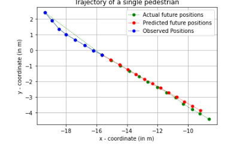
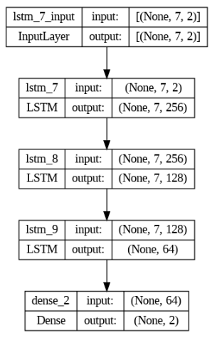
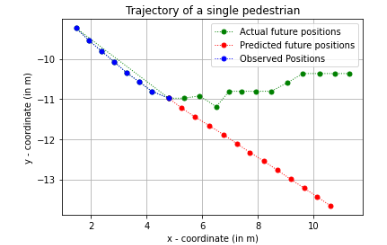
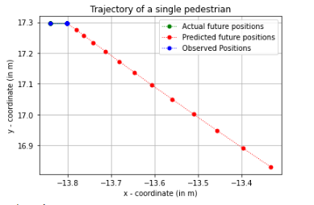

# Objectif
L'objectif de cette partie est de prédire la trajectoire future d'un piéton en se basant sur des positions passées connues à l'aide d'une solution de machine/deep learning.
Dans ce cas précis, les 8 premières positions d'un piéton sont données et les 12 suivantes doivent être prédites à l'aide de ces informations. Le problème est illustré dans l'image suivante.

	 

		Exemple de trajectoire d'un piéton. A l'aide des huit premières observations

## Solution

L'ensemble de données de position donné a d'abord été divisé en données d'entraîement, de validation et de test. Les données d'apprentissage ont ensuite été normalisées.
Puis, un réseau de neurones basé sur le modèle LSTM a été entraîné sur 20 epoch avec des batch de taille 16 avec un learning rate de 0.00005.

	 

		Représentation du modèle LSTM utilisé comme solution au problème.

La prédiction des douze positions futures s'effectue de manière séquentielleLa position suivante est toujours prédite sur la base de huit données de position données. Cette dernière est ensuite à nouveau utilisée pour la prédiction suivante, etc.

## Evaluation de la solution
### Les performances

L'approche présentée a ensuite été évaluée à l'aide de deux métriques courantes.

- **Average displacement error (ADE)** : erreur moyenne entre les positions prédites et le Ground-Trouth pour tous les (12) pas de temps prédits de tous les piétons du jeu de données de test.
- **Final displacement error (FDE)** : erreur moyenne entre la position prédite et le Ground-Trouth au moment final d'un piéton, pour tous les piétons de l'ensemble de données de test.

### Cas problématiques

Beacoup des trajectoires posent problèmes car elle ne sont pas aussi simples que vu précédemment. Les changements brusques de direction et de vitesse rendent le comportement des piétons souvent imprévisible, ce qui entraîne des pertes de performance pour la prédiction. Quelques exemples :

	

 Un changement brutal de la direction provoque une erreur exponentielle de l'algorithme.

	

 Si le piéton s'arrête l'algorithme va tout de même essayer de prédire son futur déplacement.

